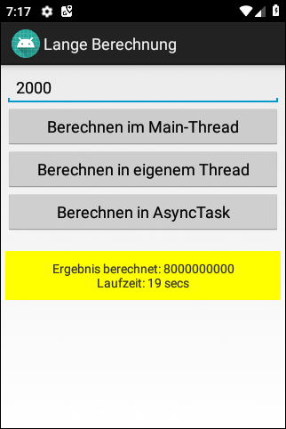

# Android-App "Langlaufende Operation" #

App shows how to implement a long running operation so that it does not block the main thread 
(prevention of error message "Application not Responding").

 

Identifiers (names for classes, variables and methods) and UI texts are in German only.

 

The is also a [variant of this app](https://github.com/MDecker-MobileComputing/Android_LangeBerechnungMitFortschrittsanzeige) 
which shows how to display the progress of the calculation.

 

----

## Screenshots ##

 

  

 

----

## License ##

 

See the [LICENSE file](LICENSE.md) for license rights and limitations (BSD 3-Clause License).

 
